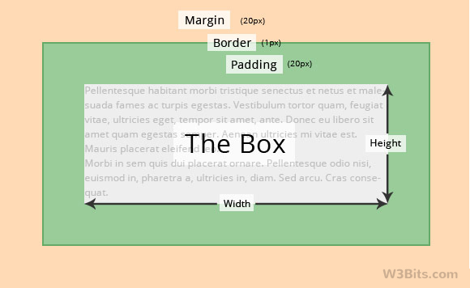

## Week 2 Recap

Kahoot!

---

## Spacing



* CSS `margin` and `padding`
* `margin-left`, `margin-top`, etc.
  * same for padding
* `border: 3px solid blue;`

---

## Divs

```html
<div>
    This is a section of my HTML page
</div>
```

* Divide your content into different sections
* Generic divider tag
* Doesn't really do much, but you can put classes and use CSS

---

## Tables

```html
<table>
    <tr>
        <td>One</td>
        <td>Two</td>
        <td>Three</td>
    </tr>
    <tr>
        <td>Four</td>
        <td>Five</td>
        <td>Six</td>
    </tr>
</table>
```

* `table` for the table
* `tr` for each row
* `td` for each cell

---

## Project

* Open Repl.it