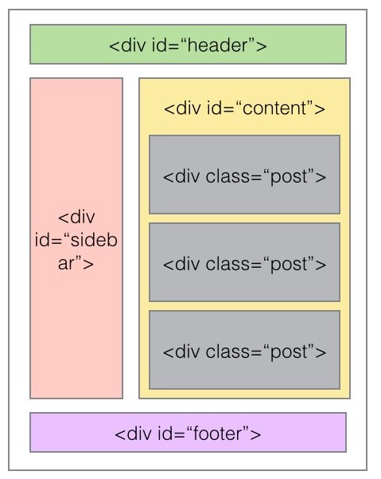
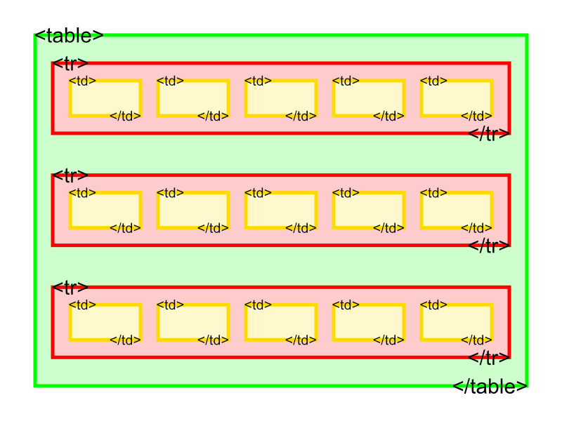

## Week 3 Review

---

## Spacing

* CSS `margin` and `padding`
* `margin-left`, `margin-top`, `margin-right`, `margin-bottom`
* `paddding-left`, `padding-top`, `padding-right`, `padding-bottom`
* `border: <width> <style> <color>;`
  * e.g. `border: 3px solid blue;`

---

## Divs

::: {.columns}
::: {.column width=40%}



:::
::: {.column width=60%}

* Different sections
* Generic divider tag
* For classes and use CSS

:::
:::


---

## Tables

::: {.columns}
::: {.column width=50%}

{height=200}

* `table` for the table
* `tr` for each row
* `td` for each cell

:::
::: {.column width=50%}

```html
<table>
    <tr>
        <td>One</td>
        <td>Two</td>
        <td>Three</td>
    </tr>
    <tr>
        <td>Four</td>
        <td>Five</td>
        <td>Six</td>
    </tr>
</table>
```

:::
:::

---

## Review Kahoot

---

## More table stuff

* `colspan` to show how many columns wide a cell should be
* `rowspan` to show how many rows tall
* `<th>` is like `<td>` but bold

---

## Forms!

* `<form>` to wrap your whole form
* `<input type="type">` for each box
  * `text` for textboxes
  * `number` for numbers
  * `email` for emails
  * `password` for passwords
  * `radio` for radio buttons
  * `checkbox` for checkboxes
  * `submit` for submit
  * textareas

---

## Example form

```html
<form>

  <label for="fname">First name:</label><br>
  <input type="text" id="fname" name="fname"><br>

  <label for="lname">Last name:</label><br>
  <input type="text" id="lname" name="lname">

  <input type="submit">

</form>
```

---

## Challenges

* Make a login form for a hypothetical website
