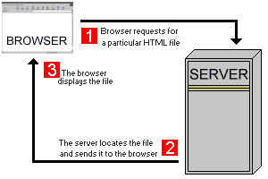
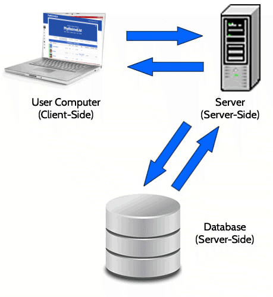
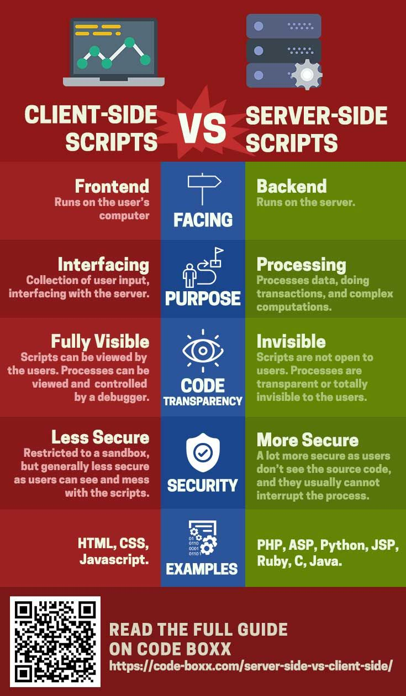
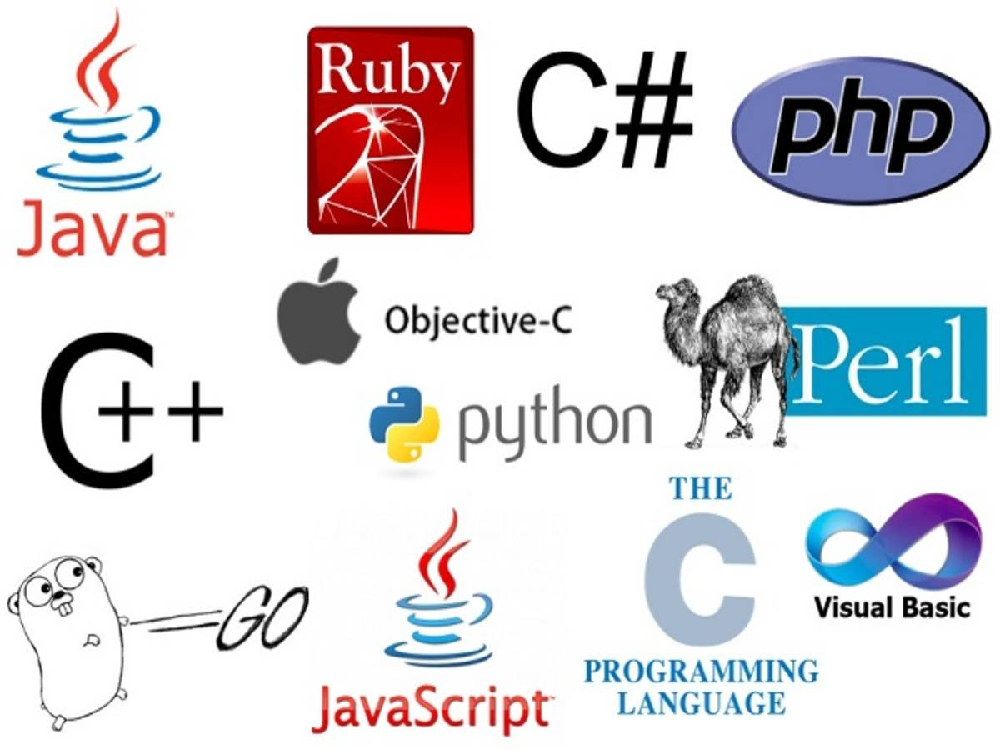
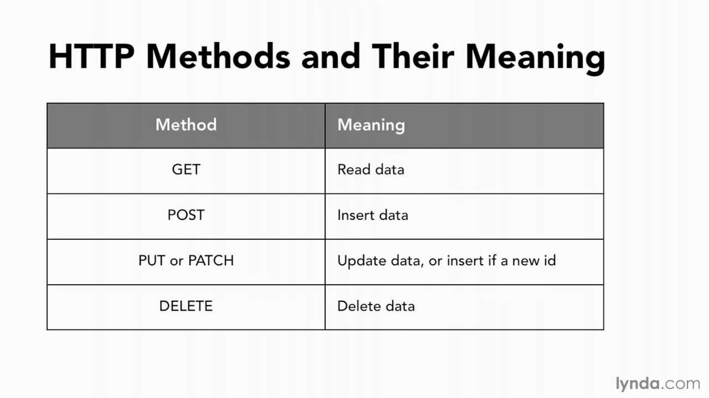
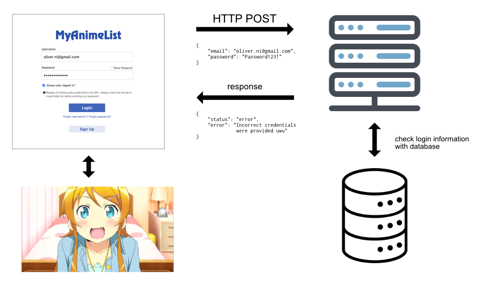

## Week 4 Recap & Finish forms

---

# Client/server stuff and the web

---

## What happens when I visit a webpage?



---

## Parts of a website

* Client (browser rendering website)
  * *frontend*
* Server (retrieves from database, communicates with client)
  * *backend*
* Database (stores information)

---

## Client vs Server



---

## Client vs Server



---

## Client vs Server

* HTML/CSS/JS for client
* Many different languages for server
* We are writing client-side code

---

## Server-side languages



---

## Different types of requests



---

## How do forms work?



---

## Form code

```html
<form action="/submitform.php" method="post">

  <label for="fname">First name:</label><br>
  <input type="text" id="fname" name="fname"><br>

  <label for="lname">Last name:</label><br>
  <input type="text" id="lname" name="lname">

  <input type="submit">

</form>
```

* Form will make a request on submit
* `action` specifies where to send the request
* `method` for which http method
* `name` specifies key-value pairs

