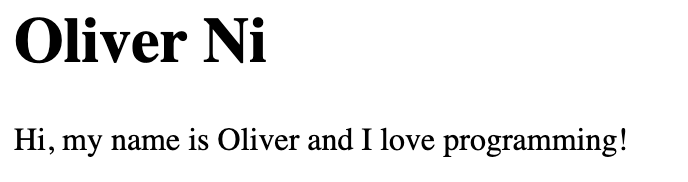
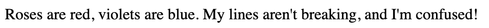
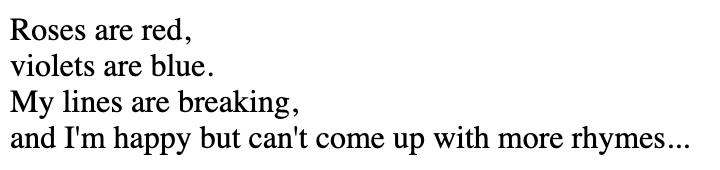
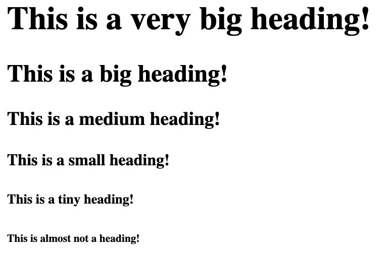
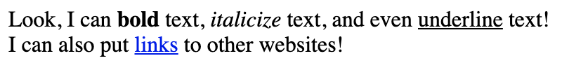
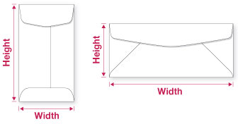

## Why learn to make a website?

* 1.7 billion websites
* Create cool stuff
* Earn some money
* Great introduction to coding

---

## What are websites made out of?

* HTML (**H**yper**T**ext **M**arkup **L**anguage)
  * Content
* CSS (**C**ascading **S**tyle **S**heets)
  * Styling
* JavaScript
  * Interactivity

---

## HTML basics

* Tags: `<div></div>`
  * Angle brackets
  * `/` means end tag
* Tags make up elements
* Elements make up page
* You can nest elements!

---

## Structure of an HTML file

```html
<!DOCTYPE html>

<html>

    <head>
        <title>Website Title</title>
    </head>

    <body>
        Website Content
    </body>

</html>
```

---

## Structure of an HTML file

* **Doctype:** let the browser know it's modern HTML
* **Head:** contains information about the page, but the user doesn't see it
* **Body:** the actual content of the page

---

## Basic elements

```html
<h1>This is a heading!</h1>

<p>This is a paragraph.</p>

<!-- This is a comment. -->
```

---

## Activity time!

* Open http://repl.it/languages/html
* Delete everything so far
  * Lots of things we haven't done yet!
* Make an example website for yourself

{height=150}

---

## Line breaks

```html
<p>
    Roses are red,
    violets are blue.
    My lines aren't breaking,
    and I'm confused!
</p>
```

{height=50}

* HTML ignores extra whitespace
* Use the `<br>` tag to make new lines

---

## Line breaks

```html
<p>
    Roses are red, <br>
    violets are blue. <br>
    My lines are breaking, <br>
    and I'm happy but can't come up with more rhymes...
</p>
```

{height=200}

---

## More headings

::: {.columns}
::: {.column width=65%}

```html
<h1>This is a very big heading!</h1>
<h2>This is a big heading!</h2>
<h3>This is a medium heading!</h3>
<h4>This is a small heading!</h4>
<h5>This is a tiny heading!</h5>
<h6>This is almost not a heading!</h6>
```

:::
::: {.column width=35%}

{width=300}

:::
:::

---

## Fun with tags

```html
<p>
    Look, I can <b>bold</b> text, <i>italicize</i> text,
    and even <u>underline</u> text!
    I can also put <a href="https://example.com">links</a>
    to other websites!
</p>
```

{height=100}

---

## Attributes

```html
This is a <a href="https://example.com">link</a>.
```

* Inside the start tag
* Provide additional information
* `href` means **H**ypertext **REF**erence (but that's not important)

---

## Images

```html

```

::: {.columns}
::: {.column}

* Display images!
* `src`: URL to the image file
* `width`: Width (pixels)
* `height`: Height (pixels)

:::
::: {.column}

{width=300}

:::
:::

---

## Project: Celebrity Website

* Pick a famous person
* Make a simple website!
* Add text, pictures
* Have fun